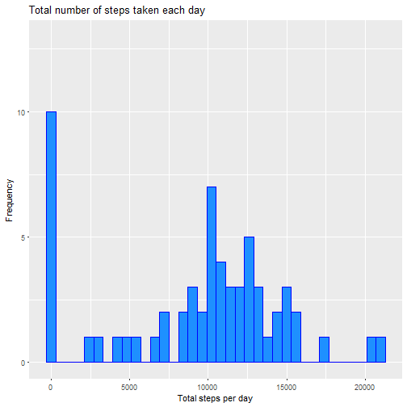
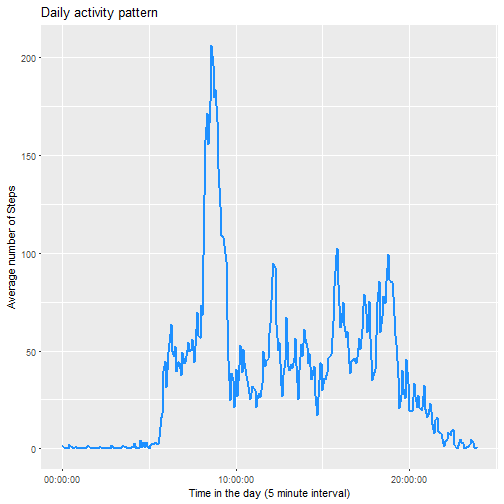
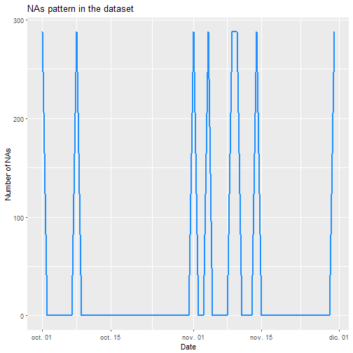
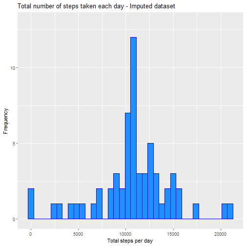
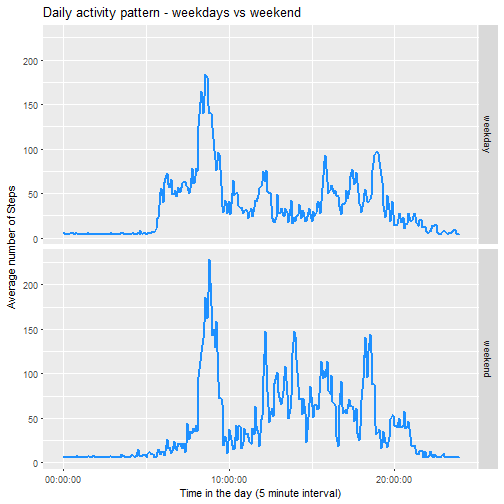

# Reproducible Research: Peer Assessment 1

## By Paola Castaño

------------------------------------------------------------------
------------------------------------------------------------------

## Introduction
This assignment makes use of data from a personal activity monitoring
device. This device collects data at 5 minute intervals through out the
day. The data consists of two months of data from an anonymous
individual collected during the months of October and November, 2012
and include the number of steps taken in 5 minute intervals each day.  

This report assumes that the data zip file has been downloaded and unzipped already.
If not, please run the next code to get the raw data. 
(Remember to set destfile according to your working directory)


```r
        # urlfile<-"https://d396qusza40orc.cloudfront.net/repdata%2Fdata%2Factivity.zip"
        # download.file(urlfile, destfile, method = curl)
        # unzip(destfile, list = TRUE)
```

Load requiered libraries to perform the script


```r
        library(dplyr) 
        library(ggplot2)
        library(lubridate)
        library(stringr)
```

Create directory to save plots and figures


```r
        if (!dir.exists("./figure")){        
                dir.create("./figure")
        }
```

------------------------------------------------------------------
------------------------------------------------------------------

## Question: Loading and preprocessing the data
##### 1. Code for reading in the dataset 


```r
        activity<-read.csv("./activity.csv", colClasses=c("integer","Date","integer"))
```

##### 2. Process and transform the data into a format suitable for this analysis.

Interval column is formatted  to time(h:m:s) by using **Lubridate Package**


```r
        time.padded <- str_pad(activity$interval, 4, pad="0")
        activity$timeint<-hm(sub("(..)$", ":\\1", time.padded))
```

------------------------------------------------------------------
------------------------------------------------------------------

## Question: What is mean total number of steps taken per day?
Missing values in the dataset are ignored for now


```r
        steps.day <- tapply(activity$steps, activity$date, sum, na.rm=TRUE)
```

##### 1. Make a histogram of the total number of steps taken each day


```r
        g1<-qplot(steps.day, 
              xlab='Total steps per day', 
              ylab='Frequency', 
              ylim = c(0,13),
              main = 'Total number of steps taken each day',
              fill=I("dodgerblue"), 
              col=I("blue"),
              binwidth=600)
        
        print(g1)
```



##### 2. Calculate and report the mean and median total number of steps taken per day


```r
        mean.steps.day <- mean(steps.day)
        median.steps.day <- median(steps.day)
```

* Mean: 9354.2295082 steps taken per day
* Median:  10395 steps taken per day

------------------------------------------------------------------
------------------------------------------------------------------

## Question: What is the average daily activity pattern?


```r
        average.day <- 
                activity %>%
                group_by(interval) %>%
                summarize(steps=mean(steps, na.rm = TRUE))
        # Format interval column to time(h:m:s)
        time.padded2 <- str_pad(average.day$interval, 4, pad="0")
        average.day$timeint<-as.duration(hm(sub("(..)$", ":\\1", time.padded2)))
```

##### 1. Make a time series plot (i.e. `type = "l"`) of the 5-minute interval (x-axis) and the average number of steps taken, averaged across all days (y-axis)


```r
        # Make the plot with ggplot2. Time series should be in time format in order to plot correctly
        g2 <- ggplot(average.day, aes(as.duration(timeint), steps))
        g2 <- g2 + geom_line(size=1, color = "dodgerblue") +
                xlab("Time in the day (5 minute interval)") +
                ylab("Average number of Steps") +
                ggtitle("Daily activity pattern") + scale_x_time()
        
        print(g2)
```



##### 2. Which 5-minute interval, on average across all the days in the dataset, contains the maximum number of steps?


```r
        maxSteps <- which.max(average.day$steps)
        maxtime <-average.day[maxSteps,"interval"]
        
        # Format interval column to time(h:m:s)
        time.padded3 <- str_pad(maxtime, 4, pad="0")
        maxtimeformat<-sub("(..)$", ":\\1", time.padded3)
```

* Maximun number of Steps at: 08:35 interval

------------------------------------------------------------------
------------------------------------------------------------------

## Question: Imputing missing values  

Code to describe and show a strategy for imputing missing data.

##### 1. Calculate and report the total number of missing values in the dataset 


```r
        numMissingValues <- sum(is.na(activity$steps))
```

* There is a total of: 2304 NA s

##### 2. Devise a strategy for filling in all of the missing values in the dataset.  

Next code illustrate if there is some patters related to NA ocurrence, and the strategy to fill in missing values


```r
        nas<-activity %>% group_by(date) %>% summarize(steps=sum(is.na(steps)))
        summary(nas)
```

```
##       date                steps       
##  Min.   :2012-10-01   Min.   :  0.00  
##  1st Qu.:2012-10-16   1st Qu.:  0.00  
##  Median :2012-10-31   Median :  0.00  
##  Mean   :2012-10-31   Mean   : 37.77  
##  3rd Qu.:2012-11-15   3rd Qu.:  0.00  
##  Max.   :2012-11-30   Max.   :288.00
```

```r
        str(nas)
```

```
## Classes 'tbl_df', 'tbl' and 'data.frame':	61 obs. of  2 variables:
##  $ date : Date, format: "2012-10-01" "2012-10-02" ...
##  $ steps: int  288 0 0 0 0 0 0 288 0 0 ...
```

According to the description, every day should have 288 measures, meaning 60 min * 24 h / 5 min interval. 
After analysis, there are 8 days with no measures at all. 


```r
        nas.days<-nas[which(nas$steps==288), "date"]
        
        g3 <- ggplot(nas, aes(date, steps))
        g3 <- g3 + geom_line(size=1, color = "dodgerblue") + 
                xlab("Date") +
                ylab("Number of NAs") +
                ggtitle("NAs pattern in the dataset") + scale_x_date()
        
        print(g3)
```



Since in this case we know that the missing data appeared randomly in the
data, it would make sense to try to impute the values. Here, I use the Hmisc package
to do a basic imputation of the missing data, by calculating the mean of the variable.   

##### 3. Create a new dataset that is equal to the original dataset but with the missing data filled in.


```r
        activityImputed <- activity
        activityImputed$steps <- impute(activity$steps, fun=mean)
```


##### 4. Make a histogram of the total number of steps taken each day 


```r
        steps.day.imputed <- tapply(activityImputed$steps, activityImputed$date, sum)

        g4<-qplot(steps.day.imputed, 
              xlab='Total steps per day', 
              ylab='Frequency',
              ylim = c(0,13),
              main = 'Total number of steps taken each day - Imputed dataset',
              fill=I("dodgerblue"), 
              col=I("blue"),
              binwidth=600)
        
        print(g4)
```




##### Calculate and report the mean and median total number of steps taken per day.  


```r
        mean.steps.day.Im <- mean(steps.day.imputed)
        median.steps.day.Im <- median(steps.day.imputed)
```

* Mean (Imputed): 1.0766189 &times; 10<sup>4</sup> steps taken per day
* Median (Imputed):  1.0766189 &times; 10<sup>4</sup> steps taken per day

The imputed values differ slightly from the estimates in the first part of the assignment.
Since the imputation strategy was to fill in missing values with the mean of the variable, 
the resulting histogram shows a normal distribution 

------------------------------------------------------------------
------------------------------------------------------------------

## Question: Are there differences in activity patterns between weekdays and weekends?
##### 1. Create a new factor variable in the dataset with two levels – “weekday” and “weekend” indicating whether a given date is a weekday or weekend day.


```r
        activityImputed$dayType <- ifelse(wday(activityImputed$date) %in% c(6,7), "weekend", "weekday")
        average.day.Imp <- 
                activityImputed %>%
                group_by(interval,dayType) %>%
                summarize(steps=mean(steps))
        # Format interval column to time(h:m:s)
        time.padded4 <- str_pad(average.day.Imp$interval, 4, pad="0")
        average.day.Imp$timeint<-as.duration(hm(sub("(..)$", ":\\1", time.padded4)))
```

##### 2. Make a panel plot containing a time series plot (i.e. type = "l") of the 5-minute interval (x-axis) and the average number of steps taken, averaged across all weekday days or weekend days (y-axis). 


```r
        # Make the plot with ggplot2. Time series should be in time format in order to plot correctly
        g5 <- ggplot(average.day.Imp, aes(as.duration(timeint), steps))
        g5 <- g5 + geom_line(size=1, color = "dodgerblue") +
                facet_grid(dayType ~ .) +
                xlab("Time in the day (5 minute interval)") +
                ylab(expression("Average number of Steps")) +
                ggtitle("Daily activity pattern - weekdays vs weekend") + scale_x_time()
        
        print(g5)
```



There are some differences in activity patterns between weekdays and weekends,mainly related
to the time at the day when the activity is performed. Weekdays activity starts early in the morning
with fewer peaks hours. Meanwhile, weekend activity begins later and shows sharp peaks during the whole day. 
